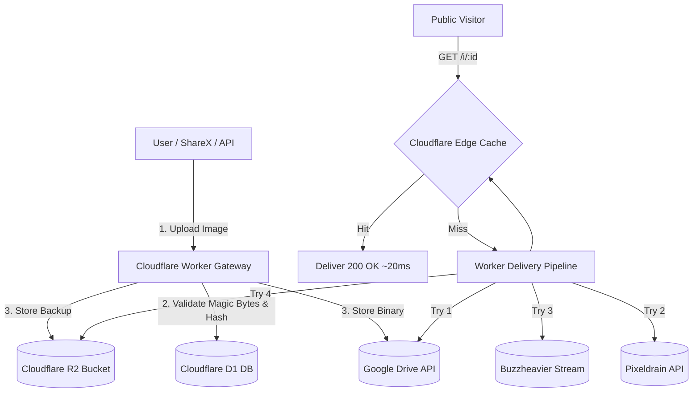

# ImgOF — High-Performance Serverless Image Hosting

[](https://workers.cloudflare.com/)
[](https://developers.cloudflare.com/d1/)
[](https://developers.cloudflare.com/r2/)
[](https://developers.google.com/drive)
[](https://www.typescriptlang.org/)
[](https://opensource.org/licenses/MIT)

**ImgOF** ([imgof.my.id](https://imgof.my.id)) is an ultrafast, privacy-focused, zero-login image hosting service engineered on Cloudflare's global edge network.

---

## 🌟 Key Features & Highlights

- ⚡ **Ultrafast Global Edge Delivery:** Sub-100ms TTFB powered by 330+ Cloudflare Anycast edge datacenters with 1-Year Immutable Caching (`max-age=31536000, immutable`).
- 🗄️ **Multi-Tier Hybrid Storage Pipeline:** Google Drive (Primary), Cloudflare R2 (High-speed Cache), Pixeldrain (Account/API backup), and Buzzheavier (Direct stream).
- ⏰ **Automated Daily Keep-Alive Cron:** Cloudflare Worker cron trigger (`0 0 * * *`) that sends zero-bandwidth (`Range: bytes=0-0`) keepalive pings to keep secondary storage files alive forever.
- 🛡️ **Defensive Security & WAF Firewall:** 
  - Dual-tier IP & IPv6 Access Control (Allowlist priority & Blocklist).
  - Magic Bytes binary inspection (JPEG, PNG, WebP, GIF, SVG).
  - SSRF protection on remote URL uploads (blocks private RFC1918/loopback ranges).
  - COOP (`same-origin-allow-popups`) & Strong HSTS (`max-age=31536000; includeSubDomains; preload`).
  - Honeypot crawler traps (`/admin-login`, `/.env`, `/wp-admin`) with Canary token alarms.
- ♿ **Full WCAG Accessibility & WebMCP:** Valid semantic forms, complete ARIA labels, and WebMCP agentic form coverage.
- 🤖 **AI & LLM-Friendly (`/llms.txt`):** Formatted to the strict [llmstxt.org](https://llmstxt.org) standard.
- 📸 **Desktop ShareX Integration:** Zero-configuration 1-click import (`/sharex.sxcu`).
- 🎯 **Privacy First:** No tracking cookies, no invasive analytics, self-service instant deletion via unique delete tokens.

---

## 🗺️ Public Routes & Endpoints

| Route | Method | Description |
|---|---|---|
| `/` | `GET` | Main Web UI with Drag & Drop, Clipboard Paste (Ctrl+V), and History |
| `/docs` | `GET` | Interactive API Documentation with cURL, JavaScript, and Python guides |
| `/faq` | `GET` | Frequently Asked Questions, retention rules, and ShareX tutorials |
| `/legal` | `GET` | Terms of Service, Acceptable Use, Privacy Policy, and DMCA contact |
| `/llms.txt` | `GET` | Standardized documentation for AI agents and LLM scrapers |
| `/sharex.sxcu` | `GET` | Desktop ShareX Custom Uploader configuration profile |
| `/i/:id` | `GET` | High-speed edge CDN image delivery with multi-storage fallback |
| `/v/:id` | `GET` | Open Graph image viewer with dynamic preview tags |
| `/api/upload` | `POST` | Binary / Multipart file upload and remote URL upload |
| `/api/delete/:id` | `DELETE, POST`| Permanent deletion across storage tiers and D1 |
| `/api/info/:id` | `GET` | Public metadata (file size, mime type, view counts, date) |
| `/api/keepalive` | `POST` | Manual trigger for storage keepalive ping routine (Admin only) |

---

## 🏗️ Architecture & Fallback Flow



---

## 🗄️ Database Schema (Cloudflare D1)

```sql
CREATE TABLE images (
    id TEXT PRIMARY KEY,
    hash TEXT UNIQUE,
    original_name TEXT,
    mime_type TEXT NOT NULL,
    size_bytes INTEGER NOT NULL,
    delete_token TEXT NOT NULL,
    views INTEGER DEFAULT 0,
    created_at INTEGER NOT NULL,
    drive_file_id TEXT,
    pixeldrain_id TEXT,
    buzzheavier_id TEXT,
    uploader_ip TEXT
);

CREATE INDEX idx_images_hash ON images(hash);
CREATE INDEX idx_images_created_at ON images(created_at);
```

---

## 🔐 Environment Variables & Secrets

Configure production secrets in Cloudflare Workers using `wrangler secret put <NAME>`:

| Secret / Variable | Type | Description |
|---|---|---|
| `UPLOAD_SECRET` | Secret | Master admin key for protected management endpoints |
| `GOOGLE_CLIENT_ID` | Secret | Google Cloud OAuth Client ID |
| `GOOGLE_CLIENT_SECRET` | Secret | Google Cloud OAuth Client Secret |
| `GOOGLE_REFRESH_TOKEN` | Secret | OAuth2 Refresh Token for Google Drive API |
| `GOOGLE_FOLDER_ID` | Secret | Google Drive target folder ID |
| `PIXELDRAIN_API_KEY` | Secret | Optional API key for Pixeldrain account storage |
| `BUZZHEAVIER_API_KEY` | Secret | Optional Account ID for Buzzheavier |
| `ALLOWED_IPS` | Secret/Var | Comma-separated list of whitelisted IPs (immune from blocklist) |
| `BLOCKED_IPS` | Secret/Var | Comma-separated list of banned IPs (blocked 403) |
| `ENVIRONMENT` | Var | Environment name (`production`) |

---

## 💻 Local Development & Deployment

```bash
# 1. Install dependencies
npm install

# 2. Build CSS and compile frontend assets
npm run build:css

# 3. Typecheck TypeScript
npx tsc --noEmit

# 4. Run local development server
npm run dev

# 5. Deploy directly to Cloudflare Workers
npm run deploy
```

---

## 📄 License

This project is open-source under the [MIT License](LICENSE).
