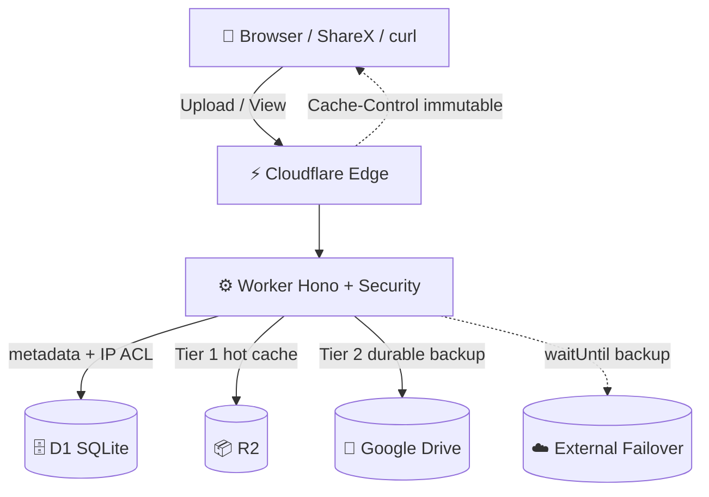

<div align="center">
  
  <h1>ImgOF — Serverless Image Hosting</h1>
  <p><strong>Ultra-fast, privacy-first, zero-login.</strong> Drag, paste, upload — copy link. No tracking.</p>
  <p>
    <a href="https://imgof.my.id"><strong>🌐 Live</strong></a> •
    <a href="https://imgof.my.id/docs"><strong>📖 API</strong></a> •
    <a href="https://imgof.my.id/about"><strong>ℹ️ About</strong></a> •
    <a href="https://imgof.my.id/my"><strong>🖼️ My Gallery</strong></a> •
    <a href="https://imgof.my.id/status"><strong>⚡ Status</strong></a> •
    <a href="https://imgof.my.id/stats"><strong>📊 Stats</strong></a>
  </p>
  <p>
    <a href="https://workers.cloudflare.com/"></a>
    <a href="https://developers.cloudflare.com/d1/"></a>
    <a href="https://developers.cloudflare.com/r2/"></a>
    <a href="https://developers.google.com/drive"></a>
    <a href="https://www.typescriptlang.org/"></a>
    <a href="LICENSE"></a>
  </p>
</div>

---

## ✨ Why ImgOF

- **Zero friction** — no account, no email. Upload → copy link in < 1s.
- **Fast everywhere** — 330+ Cloudflare edge PoPs, `immutable` 1-year CDN cache.
- **Private by default** — no analytics, no ads. IP encrypted at rest, EXIF GPS auto-stripped.
- **Yours to delete** — every upload returns a `delete_token`. Also in `localStorage` at `/my`.

## 🏗️ Architecture



| Tier | Role | When used |
|------|------|-----------|
| **R2** | Hot object store | Primary read/write, CDN-cached |
| **Google Drive** | Durable backup | Redundancy + large-file fallback |
| **External** | Failover (internal) | Background `waitUntil` only, not user-facing |

Scale: zero servers, `compatibility_date` pinned, auto-scale per request. Assets served via `wrangler.toml [assets] not_found_handling="none"` (native CDN, no Worker overhead for static).

---

## 🌟 Features

- ⚡ **Edge CDN** — `Cache-Control: public, max-age=31536000, immutable` on `/i/:id`.
- 🛡️ **Security at edge:**
  - Magic-bytes validation (JPEG/PNG/WebP/GIF/SVG only)
  - SSRF guard on URL uploads (`isPrivateIP`)
  - CSP/HSTS/COOP/nosniff headers via `public/_headers`
  - IPv4 `/24` + IPv6 ACL (`ALLOWED_IPS` / `BLOCKED_IPS`)
  - Rate-limit per IP + Turnstile (optional)
- 🗜️ **Smart upload** — browser compresses `>1MB → WebP` before POST; server rejects `>10MB`.
- ⏱️ **Expiry** — `?expires=1h|24h|1w|1m|permanent` → soft-delete + 30-day encrypted backup retention (PDP §6).
- ♿ **A11y + DX** — WCAG/ARIA, keyboard nav, `llms.txt` + `WebMCP` forms, `ShareX` 1-click (`/sharex.sxcu`).
- 🔔 **Ops** — Telegram deploy/DMCA alerts (`TELEGRAM_BOT_TOKEN`), Daily Cron `0 0 * * *` keepalive ping.
- 🧹 **Privacy ops** — `EXIF GPS` strip keeps only `Orientation 0x0112`; `DELETE` is R2-only (Drive retained for recovery).

---

## 🗺️ Endpoints

### Pages

| Route | Description |
|-------|-------------|
| `/` | Upload UI (drag, paste Ctrl+V, URL, local history 3) |
| `/my` | Local gallery — `localStorage` history, search, `Copy links (Direct/MD/HTML/BB)`, delete |
| `/docs` | API docs with cURL / JS / Python snippets |
| `/about` | Why / how / tech / limits (`berbagi cepat, bukan arsip`) |
| `/faq` | FAQ + ShareX guide |
| `/status` | Health (`/api/ping` + storage pipeline) |
| `/stats` | Public upload counts + size |
| `/legal` | 7-section Terms + Privacy + DMCA (6 elements, 3–5 days) |
| `/contact` | Support / abuse |
| `/llms.txt` | AI-agent manifest |

### Images & API

| Route | Method | Notes |
|-------|--------|-------|
| `/i/:id` | `GET` | CDN-cached file (`Content-Type` preserved) |
| `/v/:id` | `GET` | OG viewer page |
| `/api/upload` | `POST` | `multipart/form-data` `file` or `url`; returns `{id, url, delete_url, delete_token}` |
| `/api/delete/:id` | `DELETE` / `POST` | Header `Authorization: Bearer <delete_token>` (or `?token=` fallback) |
| `/api/info/:id` | `GET` | `{id, mime, size, views, created_at, expires_at}` |
| `/api/stats` | `GET` | Global counters JSON |
| `/api/ping` | `GET` | Keepalive / UptimeRobot |
| `/sharex.sxcu` | `GET` | ShareX Custom Uploader |

**Quick test:**

```bash
curl -F file=@photo.jpg https://imgof.my.id/api/upload | jq
curl -H "Authorization: Bearer <delete_token>" -X DELETE https://imgof.my.id/api/delete/<id>
```

---

## 📸 ShareX

1. Download [`imgof.sxcu`](https://imgof.my.id/sharex.sxcu)
2. Double-click → auto-import in ShareX
3. `Capture →` URL copied to clipboard

---

## 💻 Local Dev

### Prereqs

- Node 18+ / 20 recommended (CI uses `actions/setup-node@v4` + `node 20`)
- `wrangler` via `npx` (no global needed)

```bash
git clone https://github.com/raihanirfan/imagehosting.git
cd imagehosting

npm ci
cp .env.example .dev.vars        # fill secrets (never commit .dev.vars)
npm run build:css                # tailwind → public/style.css + update_frontend.js → src/routes/frontend.ts
npx tsc --noEmit
npm run dev                      # wrangler dev @ http://localhost:8787
npm run deploy                   # wrangler deploy (needs CLOUDFLARE_API_TOKEN)
```

### Env

| Var | Required | Purpose |
|-----|----------|---------|
| `ENVIRONMENT` | — | `production` / `development` |
| `UPLOAD_SECRET` | optional | Extra upload guard |
| `TURNSTILE_SECRET_KEY` | optional | CAPTCHA verify |
| `GOOGLE_*` (4) | for Drive | `CLIENT_ID`, `CLIENT_SECRET`, `REFRESH_TOKEN`, `FOLDER_ID` |
| `PIXELDRAIN_API_KEY` | internal | Failover (not shown in public copy) |
| `BUZZHEAVIER_API_KEY` | internal | Failover (not shown in public copy) |
| `TELEGRAM_BOT_TOKEN` / `CHAT_ID` | optional | Alerts |
| `ALLOWED_IPS` / `BLOCKED_IPS` | optional | ACL |

See `.env.example` + `.dev.vars.example` for templates.

### Scripts & CI

| Script | What |
|--------|------|
| `npm run build:css` | Tailwind compile + `node scripts/update_frontend.js` (embeds `public/*.html` → `src/routes/frontend.ts`, version `ASSET_VERSION=2.5` → `app.js?v=2.5`) |
| `npx tsc --noEmit` | Typecheck |
| `npm run dev` | `wrangler dev` |
| `npm run deploy` | `wrangler deploy` |

**CI:** `.github/workflows/deploy.yml` — `on: push branches: [master]` → `checkout → setup-node 20 → npm ci → build:css → tsc → wrangler-action@v3`. Needs repo secrets `CLOUDFLARE_API_TOKEN` + `CLOUDFLARE_ACCOUNT_ID`.

---

## 🔒 Privacy & Limits

- Max `10MB`, types `JPG/PNG/WebP/GIF/SVG`, dedup by `SHA-256`.
- Abuse: CSAM / malware / phishing / NCII / terrorism / doxing / copyright → instant remove + IP block.
- DMCA: `admin@imgof.my.id` subject `DMCA Takedown Request` — plain text, 6 elements (see `/legal` §7).
- Not archival — `ImgOF dirancang untuk berbagi cepat, bukan arsip jangka panjang.`

## 🗂️ Project Layout

```
public/          # static HTML + style.css + _headers + icon/manifest + llms.txt + sharex.sxcu
src/
  index.ts       # Hono app entry, routes mount
  types.ts       # Env + ImageRecord (D1 schema)
  routes/        # upload.ts, serve.ts, delete.ts, info.ts, stats.ts, frontend.ts, keepalive.ts
  utils/         # drive.ts, pixeldrain.ts, buzzheavier.ts, stripExif.ts, telegram.ts, rateLimit.ts
  middleware/    # auth, csp, ipFilter
scripts/update_frontend.js  # embeds HTML → frontend.ts
wrangler.toml    # [assets], [d1_databases], [r2_buckets], [routes], crons
```

---

## 📄 License

MIT — see [LICENSE](LICENSE).
